# Loppuraportti

## Hannu Oksman L2912

## Ville Paananen L4079

## Antti Tarvainen L4623

### Opintojakso TTZC0800 Tietokannat

### Vaatimusmäärittely

[Vaatimusmäärittely-dokumentti](/Vaatimusmäärittely)

### Käyttötapauskaavio

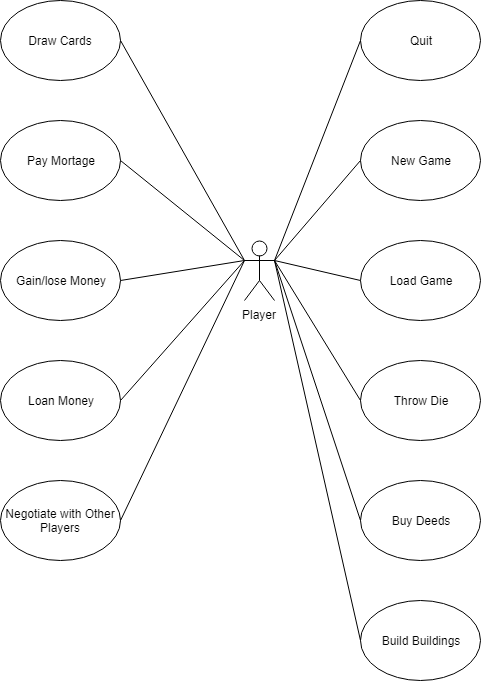

### Käsite-ehdokkaista tehty käsitemalli

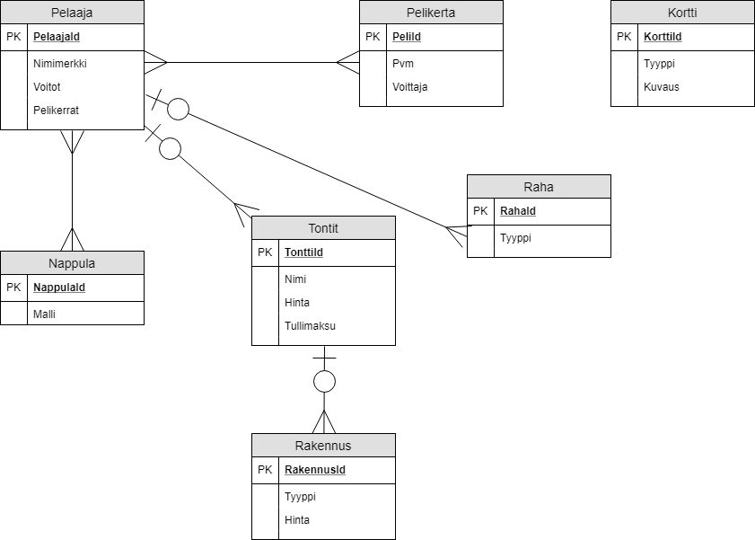

#### Huomiot
* Tämä on ensimmäinen iteraatio, jonka teimme käsite-ehdokaslistan pohjalta. Tässä havaitsimme monta ongelmaa.
* Mallintaa tarpeettoman tarkasti fyysistä lautapeliä, jossa Raha, Tontit ja Nappula ovat sidottuja Pelaajaan, joka tuo ne Pelikertaan.
* Ei salli rinnakkaisia pelejä, vaan pitää pelata sarjassa.

### Draw.io:sta Workbenchiin

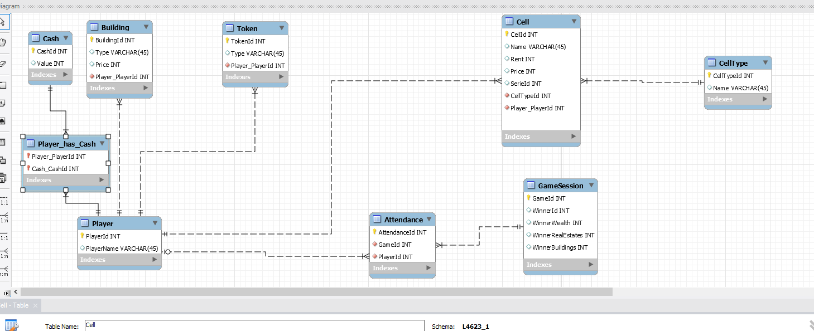

#### Huomiot
* Moni-moneen-yhteydet purettu. Kokeiltu, että Player on moni-moneen-suhteessa muihin käsitteisiin. Tässä toteutettu vain Player_has_Cash ja Attendance.
* Edelleen pelaaja kuljettaa muita käsitteitä.
* Toimii vain jos on yksi peli kerrallaan. Välitaulut pitäisi tyhjentää ennen kuin voi pelata seuraavan pelin, koska jos Player 1 on Cash 1, niin Cash 1 ei voi käyttää muissa peleissä.

### Vain yksi moni-moneen-välitaulu

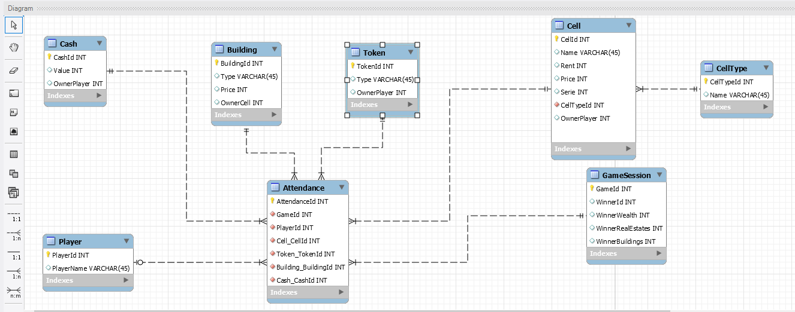

#### Huomiot
* Kokeilimme uutta lähestymistapaa, jossa oelaaja ei enää tuo rahoja ym. peliin.
* Käsitteisiin lisätty Owner. Tästä seuraa vieläkin se, että vaikka rahat voivat kuulua moniin peleihin, niin ne eivät voi tehdä sitä samanaikaisesti.
* Lisäksi tässä on uutena ongelmana se, että Attendance-tauluun tulee erittäin paljon null-soluja. Nyt meillä on 200 Cash, ja koska Cash on Attendancen viiteavain, niin Attendance-tauluun tulee vähintään kaksi sataa riviä, joissa suurin osa on null.
* Nullien suuri määrä on selkeä merkki, että käsitemalli ei ole hyvä.

### Lopullinen versio

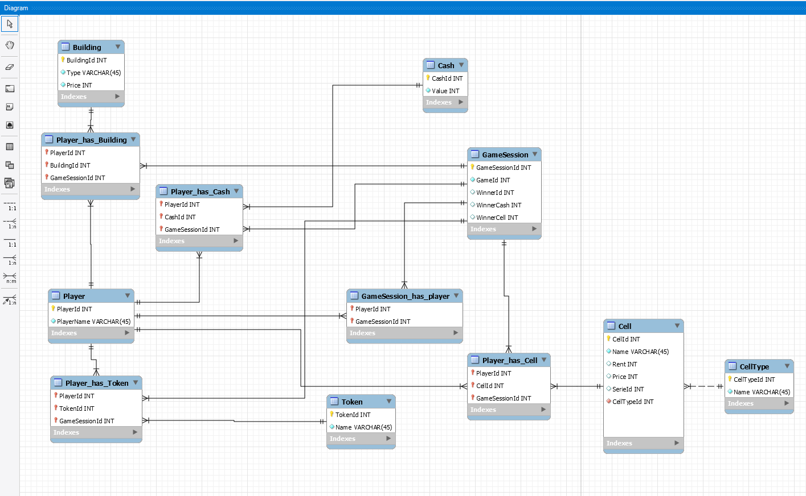

#### Huomiot
* Välitauluissa on pelaaja ja peli, jotka yhdessä kunkin käsitteen id:n kanssa muodostavat pääavaimen. Esim. sama raha voi olla nyt monessa pelissä samanaikaisesti, koska komposiittipääavain on erilainen.
* 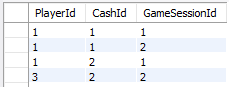
* 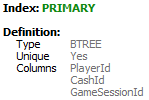
* Uniikki indeksi pelille ja ei-pelaajalle. Estää esim. saman rahan olemassaolon usealla pelaajalla samassa pelissä.
* 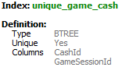
* 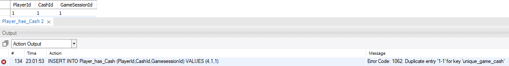

### DDL ja DML

[schema.sql](../SQLmaterials/schema.sql)

#### Huomioita
* Viimeisimmässä Workbenchin ER-kaaviossa ei vielä käytetty proseduureja. Lisäsimme ne lennosta suoraan valmiiseen tietokantaan ja päivitimme tietokannan luontiskriptiä. 
* Myöskään ei ollut vyörytyssääntöjä. Säilytämme GitHubissa tiedostoja, ja helpointi oli lisätä vyörytyssäännöt Wordin kautta käyttäen Replace All -toimintoa.
* Lisäsimme myös yhden näkymän suoraan luontiskriptiin ja asetimme eristävyystason korkeimmaksi.

### Datan lisäys

[insert_into.sql](../SQLmaterials/insert_into.sql)

#### Huomioita
* Aluksi ajattelimme että asetamme käsin CellId:n (pelilaudan ruutujen), jotta voisimme helpommin vaihtaa järjestystä käyttöliittymässä. Piirto tapautuisi toistorakenteessa id:n mukaan.
* Luontiskriptin ajo pysähtyi tästä syystä tietenkin heti pääavainkonfliktiin. Päätimme lisätä lennosta CellId auto_increment.
* alter table Cell modify column CellId int auto_increment;
* Myöhemmin lisäsimme sen suoraan tietokannan luontiskriptiin.

### Rivit lisäyksen jälkeen

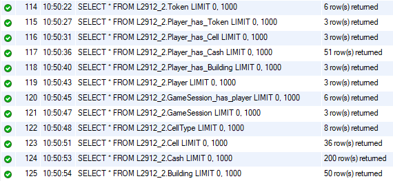

### Vyörytys toimii. Poistettaessa pelaaja myös raha vapautuu

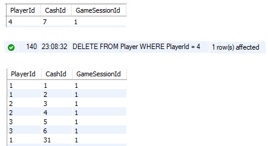

### Näkymä toimii

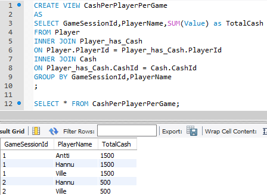

### Kysely toimii

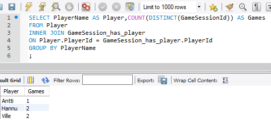

### Proseduuri toimii

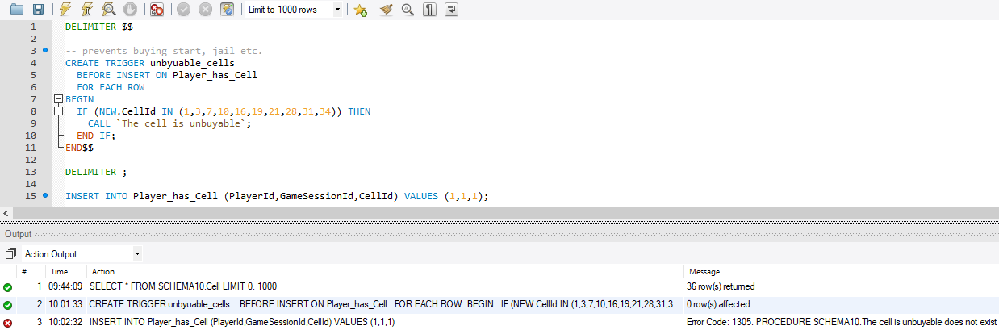

### Mysql serverin asennus Raspberry Pi:lle

Päätimme käyttää raspille asennettua tietokantaa, jotta tietokantaa pystyisi käsittelemään yhtä aikaa ilman jamkin mysql serverin käyttöä. Tämä toimi ulkopuolisilta tietokoneilta hyvin, mutta labranetin sisäisiltä koneilta yhdistäminen tietokantaan ei onnistu. Tämä tuotti ongelmia kouluaikana harjoitustyön tekemiseen, mutta vapaa-ajalla raspilla oleva serveri toimi hyvin.

Suurin ongelma mysql serverin asentamisessa Pi:lle oli, että mysql ei vakiona salli kuin localhostin yhdistämisen palvelimelle. Tämä ratkesi kuitenkin poistamalla mysql asetustiedostosta bind-
