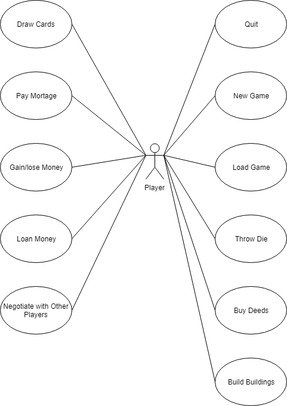
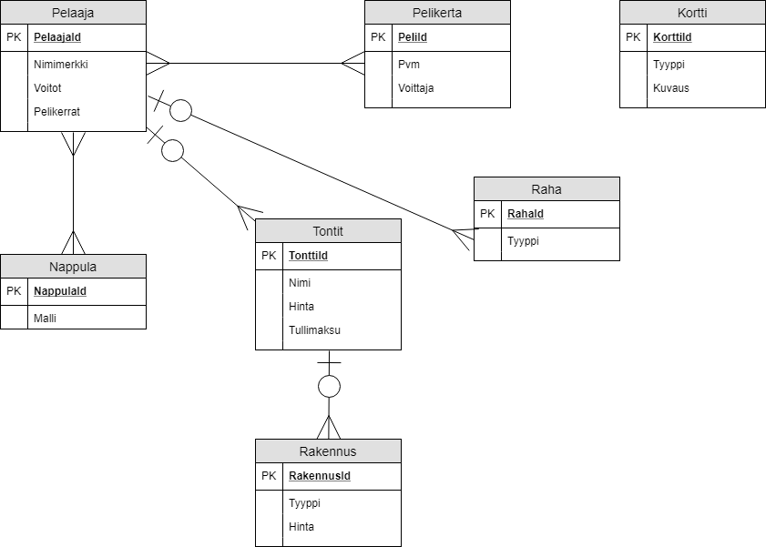

# Peliklooni

## Hannu Oksman, Ville Paananen, Antti Tarvainen

### Vaatimusmäärittely

[Vaatimusmäärittely](/Vaatimusmäärittely)

### Käyttötapauskaavio

### Käsite-ehdokkaista tehty käsitemalli

### 1

### 2

### Final

#### Moni-moneen-yhteyksien olettamukset

