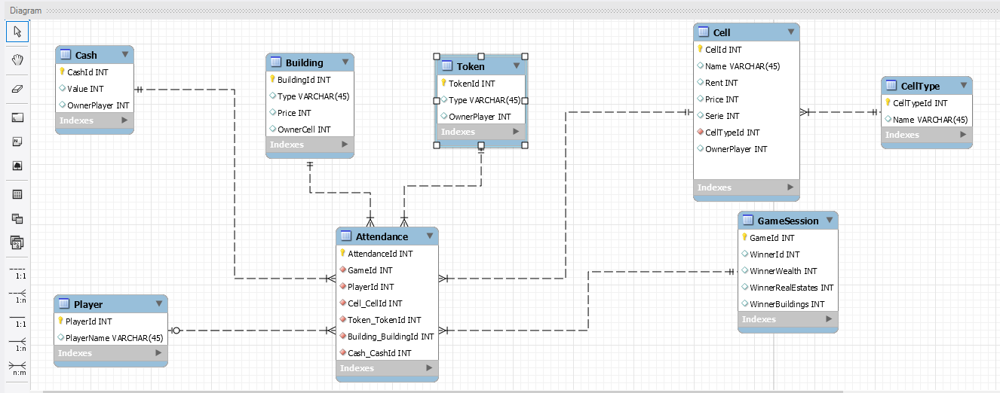

# TODO
# POISTA LOPULLISESTA VERSIOSTA
* ON DELETE ON UPDATE
* queries
* mysql-palvelimen luonnista ja käytöstä raportointi
* view
# END OF TODO

# Peliklooni

## Hannu Oksman, Ville Paananen, Antti Tarvainen

### Vaatimusmäärittely

[Vaatimusmäärittely](/Vaatimusmäärittely)

### Käyttötapauskaavio

### Käsite-ehdokkaista tehty käsitemalli

#### Huomiot
* Mallintaa tarpeettoman tarkasti fyysistä lautapeliä, jossa Raha, Tontit ja Nappula ovat sidottuja Pelaajaan, joka tuo ne Pelikertaan.
* Ei salli rinnakkaisia pelejä, vaan pitää pelata sarjassa.

### Draw.io:sta Workbenchiin

#### Huomiot
* Moni-moneen-yhteydet purettu.
* Edelleen pelaaja kuljettaa muita käsitteitä.

### Vain yksi moni-moneen-välitaulu

#### Huomiot
* Pelaaja ei enää tuo rahoja ym. peliin.
* Käsitteisiin lisätty Owner. Tästä seuraa, että vaikka rahat voivat kuulua moniin peleihin, niin ne eivät voi tehdä sitä samanaikaisesti.

### Final

#### Huomiot
* Välitauluissa on pelaaja ja peli, jotka yhdessä kunkin käsitteen kanssa muodostavat pääavaimen. Esim. rahat voivat olla nyt monessa pelissä samanaikaisesti.
* 
* Uniikki indeksi pelille ja ei-pelaajalle. Estää esim. saman rahan olemassaolon usealla pelaajalla samassa pelissä.
* 

### DDL ja DML

[schema](../SQLmaterials/schema.sql)

### Datan lisäys

[insert into](../SQLmaterials/insert_into.sql)
